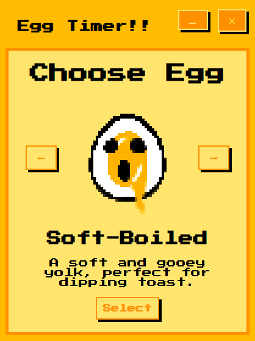

# ⏳ Egg Timer ! !

A retro arcade-styled, pixelated egg timer desktop app for soft, medium, and hard-boiled eggs, built with **Electron** and **JavaScript**. 

<div align="center"> 
    
</div>

## 🛠 Technologies
- `HTML`
- `CSS`
- `JavaScript`
- `Node.js`
- `Electron`

## 🐣 Features
- Arrow-button selection of eggs with unique visuals and descriptions
- Brief instructions per egg before starting
- Countdown timer with start/reset button
- Notification sound and auto-focus (if minimized) when timer is finished
- Sound effects for buttons
- Back buttons to prevent getting stuck on any screen
- Reset to home screen after completion
- Optional Desktop build for Windows or MacOS

## 👩🏽‍🍳 The "Why" and The Process
I built this project with two main focuses. The first was for my Mom to be able to cook both soft-boiled and medium-boiled eggs at ease. While the second, was the opportunity to learn and deeper my understanding of web development tools and the creation of desktop apps. 

I started by first planning out the UI on Procreate and documenting my ideas in the form of rough sketches. Following this, I began to draw the egg pictures (`softEgg.png`, `mediumEgg.png`, `hardEgg.png`) that were used for the center piece of the desktop application. 

With the general idea and assets fully drawn, I began coding starting with the **HTML** and once most of the bare logic was applied, I worked on the **CSS** along side it. I designed the UI to be not only easy to use for anyone of any age, but also to be aesthetically appealing.

When everything looked up to my standards, I began working on the **JavaScript** portion, implementing the screen swapping first, then the scroll buttons, and finally the timer functions. 

The project was mostly done at this point, but I felt as though there could be more so I decided to return to the drawing board with ideas. To further enhance the user-friendly experience, I added the back buttons and various different [sound effects from Pixabay](https://pixabay.com/sound-effects/). I also added some minor "wobble" effects to the images to bring more life to the app. To further improve QOL, I implemented auto-focus so the timer both signals an audio alarm cue and it appears on screen if the user minimized it. 

Finally, I learned a bit of **Electron**, to be able to package my app into both a `.exe` file and a `.app` file for both MacOS and Windows. This was so I can easily access the app when needed and be able to package and send it to my friends and family to start using. 

## 📚 Challenges and What I Learned

This project taught me a lot about both life-skills and fairly new languages that I haven't touched much on beforehand. 

### 📅 Planning:
- During the process of this project, I came across a lot of unforeseen problems. One of which was the back buttons. The lack of, was making initial test more difficult, having to refresh my browser each time. With better planning of my project, I could have easily solved this problem early on instead of going back to implement it later.

### 📌 `Date.now()`:
- I learned A LOT about JavaScript through this project and more specifically `Date.now()`. This simple change from using only `setInterval()` made the difference between my app running in the background and not being able to accurately time in the background. This was greatly impactful towards my learning but also the project as a timer that can't run in the background is quite meaningless. 

### ✨ Electron:
- **Electron** was a great takeaway from this project as it has opened the door to many new ideas for me. It also gives me an entry-idea into creating projects and delivering it and I am happy to have discovered and learned about it. Although my level is still begineer for this tool, this project made me realize what is possible and how to do it. I learned how to "package" and make "builds" off desktop apps that can be easily sent to others so that they may use the app instead of needing to go through the hassle of `npm`.

### 💡 `<div>`:
- I learned this element of **HTML** before, but this project has made me realize just how easy and effective **CSS** is when using `<div>` as well as its `class` and `id` correctly. 

## 💪 Some Improvements?
- Add feature to cusomtize time
- Add more in depth instructions
- Add volume control
- Add alarm sounds to choose from
- Add dark and light themes/modes
- Add more animations/visuals
- Add fried egg option and features
- Add desktop app icon
- Implement usability for mobile devices
- Use graphics for buttons

## 🚀 How to Run the Project

### 1. Clone the Repo
```bash
git clone https://github.com/ben07br/egg-timer.git
cd egg-timer
```
### 2. Install Dependencies
```bash
npm install
```
### 3. Run the App (Dev Mode if Needed)
```bash
npm start
```
### Build the App (Optional)
```bash
#For Windows:
npm run build:win

#For MacOS:
npm run build:mac
```
- Building the app makes it easier to run on your own device. Once built, the `.exe` (for Windows) or the `.dmg` (for MacOS) will be downloaded to a `dist` folder in the same directory. This can be moved anywhere you'd like, and to start the application simply double click the app and start cooking!

## 🎬 Video Demo

https://github.com/user-attachments/assets/6c16884f-aaa4-4a6d-bb40-b9c6aedd9224